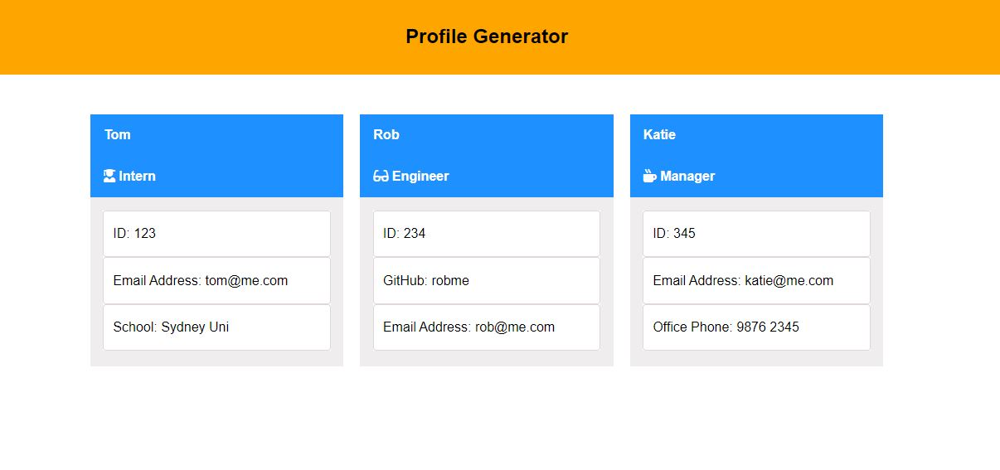

# Team Profile Generator

## Licensing

## Table of Contents

- [Description](#description)
- [Installation](#installation)
- [Usage](#usage)
- [Additional Info](#additional-info)

## Visual Presentation

The full movie file showing functionality of the application can be found here through google drive: (<https://drive.google.com/drive/folders/1DK-jguR8tI7MdttriiKOIqJm2RFrNELw?usp=sharing>)

## Description

The above video is a demonstration of how this 'deployed' application works. Created to generate TEAM PROFILE files that use a consistent format.

- GIVEN a command-line application that accepts user input
- WHEN I am prompted for my team members and their information
- THEN an HTML file is generated that displays a nicely formatted team roster based on user input
- WHEN I click on an email address in the HTML
- THEN my default email program opens and populates the TO field of the email with the address
- WHEN I click on the GitHub username
- THEN that GitHub profile opens in a new tab
- WHEN I start the application
- THEN I am prompted to enter the team manager’s name, employee ID, email address, and office number
- WHEN I enter the team manager’s name, employee ID, email address, and office number
- THEN I am presented with a menu with the option to add an engineer or an intern or to finish building my team
- WHEN I select the engineer option
- THEN I am prompted to enter the engineer’s name, ID, email, and GitHub username, and I am taken back to the menu
- WHEN I select the intern option
- THEN I am prompted to enter the intern’s name, ID, email, and school, and I am taken back to the menu
- WHEN I decide to finish building my team
- THEN I exit the application, and the HTML is generated

## Installation

- Download it through Github <https://github.com/mskippen/10-Team-Profile-Generator.git>
- Pre-install inquirer <https://www.npmjs.com/package/inquirer>
- Pre-install jest <https://jestjs.io/docs/getting-started>

## Usage

- Open terminal
- Type 'node index.js'
- Answer the prompts that follow
- On success a Team Profile Generator will be generated in dist.

## Additional Info

- Github: [mskippen](https://github.com/mskippen)
- Email: msmskippen@gmail.com
